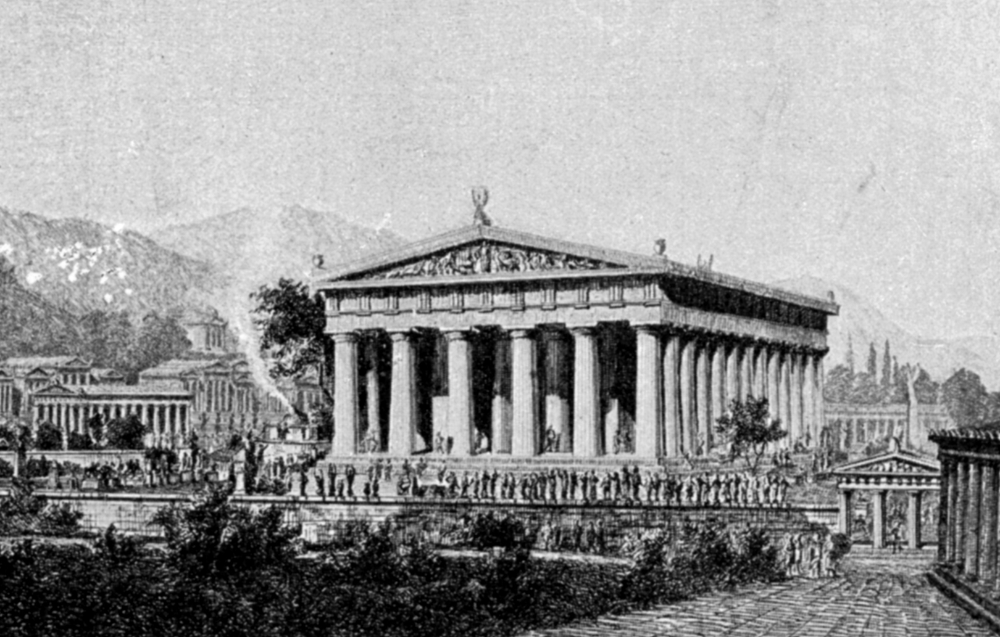

---

layout: default

style: |
    html {
      background: url(/pictures/bg.png)
    }

    body.full {
      -webkit-box-shadow: 0px 5px 30px 1px rgba(0, 0, 0, 0.3);
      box-shadow: 0px 5px 30px 1px rgba(0, 0, 0, 0.3);
    }

    #Cover img {
      width: 100%
    }

    #Cover h2 {
        margin:65px 0 0;
        color:#FFF;
        text-align:center;
        font-size:70px;
        }
    #Cover p {
        margin:10px 0 0;
        text-align:center;
        color:#FFF;
        font-style:italic;
        font-size:20px;
        }
        #Cover p a {
            color:#FFF;
            }

    #Picture1 p, #Picture p,
    #Picture1 h2, #Picture h2 {
        color:#FFF;
        }

    #Picture img {
      left: auto;
      right:0;
      top: auto;
      bottom: 0;
      height:70%
    }

    #Picture1 img {
      width: 100%
    }
    #SeeMore h2 {
        font-size:100px
        }
    #SeeMore img {
        width:0.72em;
        height:0.72em;
        }
---

# Архитектура без зависимостей {#Cover}

*[Андрей Кулаков](http://pepelsbey.net/)*

## О чём?

* ООП
* Зависимость vs Связность
* Инверсия управления (IoC) 

## Зависимость (Dependency) &nbsp;&nbsp;&nbsp;&nbsp;&nbsp;&nbsp; Связанность (Coupling) 
{:.cover #Picture}

Характеристика взаимосвязи модуля с другими модулями

## Пример


  class User
  end


## Связность, Сцепление (Cohesion)
{:.cover #Picture1}

Характеристика взаимосвязи элементов модуля между собой

## Сохранение состояния пользователя в веб-приложении

* Язык пользователя
* Данные аутентификации
* ...

## Plain Texot on Your Slides

Lorem ipsum dolor sit amet, consectetur [adipisicing](#all-kind-of-lists) elit, sed do eiusmod tempor incididunt ut labore et dolore magna aliqua. Ut enim ad minim veniam, *quis nostrud* exercitation ullamco laboris **nisi ut aliquip** ex ea commodo consequat. Duis aute irure <i>dolor</i> in reprehenderit in voluptate velit esse cillum <b>dolore</b> eu fugiat nulla pariatur. Excepteur sint occaecat cupidatat non proident, sunt in `<culpa>` qui officia deserunt mollit anim id est laborum.

## All Kind of Lists

1. Simple lists are marked with bullets
2. Ordered lists begin with a number
3. You can even nest lists one inside another
    - Or mix their types
    - But do not go too far
    - Otherwise audience will be bored
4. Look, seven rows exactly!

## Serious Citations

<figure markdown="1">

> Lorem ipsum dolor sit amet, consectetur adipisicing elit, sed do eiusmod tempor incididunt ut labore et dolore magna aliqua. Ut enim ad minim veniam, quis nostrud exercitation ullamco laboris nisi ut aliquip ex ea commodo consequat. Duis aute irure dolor in reprehenderit in voluptate velit esse cillum dolore eu fugiat nulla pariatur. Excepteur sint occaecat cupidatat non proident, sunt in culpa qui officia.

<figcaption>Marcus Tullius Cicero</figcaption>
</figure>

## Code Samples

    <!DOCTYPE html>
    <html lang="en">
    <mark><head></mark> <mark class="comment"><!--Comment--></mark>
        <title>Shower</title>
        <meta charset="<mark class="important">UTF-8</mark>">
        <link rel="stylesheet" href="screen.css">
    <mark></head></mark>

## You can even shout this way
{:.shout}

## Inner Navigation

1. Lets you reveal list items one by one
2. {:.next}To keep some key points
3. {:.next}In secret from audience
4. {:.next}But it will work only once
5. {:.next}Nobody wants to see the same joke twice

##  [See more on GitHub](https://github.com/shower/shower/)
{:.shout #SeeMore}
